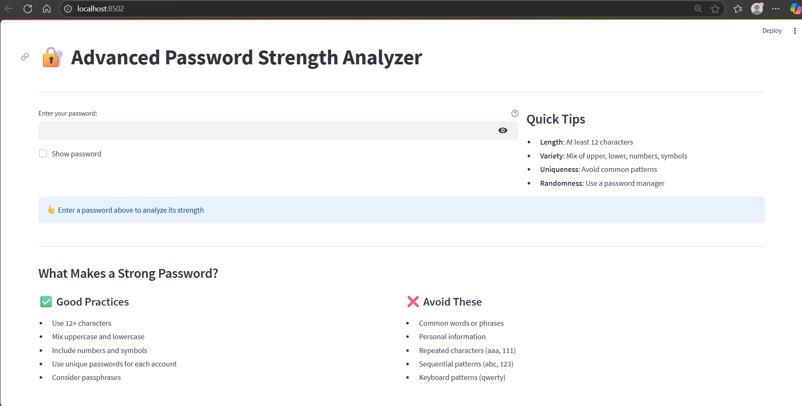

# 🔐 Password Strength Checker (Streamlit App)

This is a **Streamlit-based web application** that evaluates the strength of passwords using the **password entropy algorithm**. It estimates the strength of a given password based on character diversity and length, providing useful feedback to help users create more secure passwords.

---

## 📊 Features

- Calculates **entropy in bits** based on character sets used:
  - Uppercase letters
  - Lowercase letters
  - Digits
  - Special symbols
- Dynamically adjusts entropy formula depending on character variety.
- Provides **real-time feedback**:
  - Suggestions on what to improve (e.g., "Add digits or symbols")
  - Password strength categories:
    - 🔴 Very Weak
    - 🟠 Weak
    - 🔵 Strong
    - 🟢 Very Strong

---

## 🧠 What is Password Entropy?

**Password Entropy** is a measure of how unpredictable a password is, typically expressed in **bits**. Higher entropy means a password is harder to guess or crack via brute-force.

**Entropy** = log₂(R^L)


Where:
- `R` = number of possible characters used
- `L` = length of the password

---

## 🚀 How to Run

### 1. Clone the Repository
```bash
git clone https://github.com/UmangVadukar/Password-Strength-Checker.git
```
```
 cd password-entropy-checker
 ```

 ### 2. Install Requirements 

 ```
 pip install streamlit
 ```

 ### 3. Run The Project
 ```
 streamlit run bis.py
```
## 📸 App Screenshot




